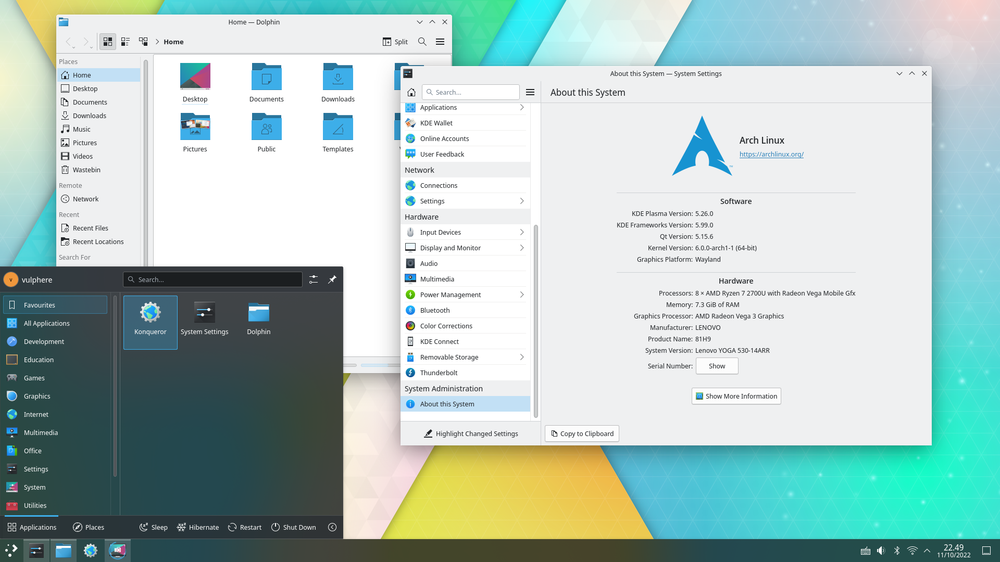
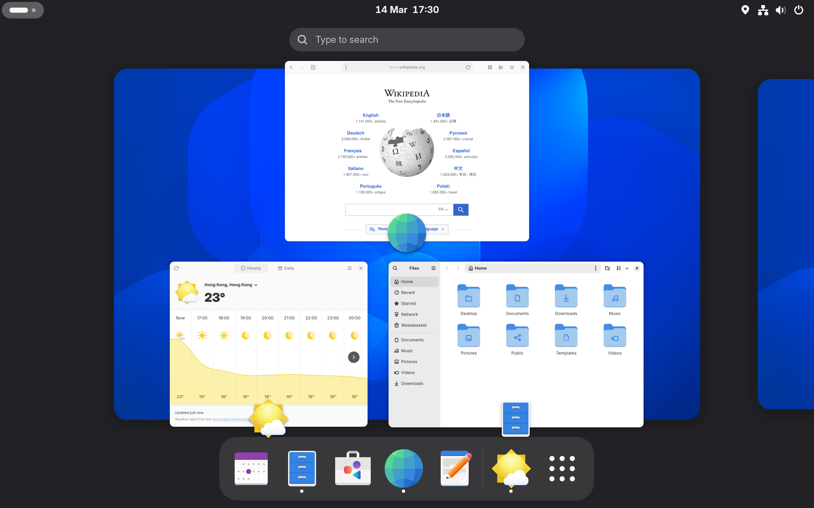

# KDE ولا GNOME؟ أنهي Desktop Environment أحسن؟

لو بتستخدم Linux، فغالبًا من أول الحاجات اللي هتقابلك هي اختيار **Desktop Environment (DE)** مناسب ليك.

وأشهر اختيارين هتسمع عنهم هما **KDE Plasma** و **GNOME**.

الاتنين ممتازين جدًا، وكل واحد فيهم ليه فلسفة مختلفة في تصميم سطح المكتب وطريقة استخدامه.
KDE بيركز بشكل كبير على **الـ customization والمرونة**، بينما GNOME بيركز أكتر على **البساطة وتجربة استخدام موحدة**.

فالسؤال هنا مش بس: **مين الأحسن؟**

لكن الأهم:

> **مين الأنسب لطريقة استخدامك؟**

في المقال ده هنقارن KDE وGNOME من كذا ناحية، وفي الآخر هنشوف تختار أنهي واحد.

---

## يعني إيه Desktop Environment؟

قبل ما ندخل في المقارنة، خلينا نفهم الأول يعني إيه **Desktop Environment**.

الـ Desktop Environment هو مجموعة من البرامج والأدوات اللي بتوفرلك الواجهة الرسومية اللي بتتعامل معاها على Linux.

يعني الحاجات اللي بتشوفها وتستخدمها يوميًا، زي:

* الـ Windows
* الـ Panels
* الـ Taskbar
* الـ Application Launcher
* الـ File Manager
* إعدادات النظام
* الـ Notifications
* إدارة الـ Workspaces
* والـ Window Management

ببساطة، هو اللي بيحدد **شكل وطريقة استخدام سطح المكتب بتاعك**.

ومن أشهر الـ Desktop Environments الموجودة على Linux:

* KDE Plasma
* GNOME
* Xfce
* Cinnamon
* MATE
* وغيرها

لكن في المقال ده هنركز على أشهر منافسين: **KDE Plasma وGNOME**.

---

# أولًا: إيه هو KDE Plasma؟

**KDE Plasma** هو Desktop Environment مفتوح المصدر، واللي يعتبر من أكتر بيئات سطح المكتب المرنة والقابلة للتخصيص على Linux.

الفكرة الأساسية في KDE هي إنك مش لازم تتعامل مع الـ Desktop بالطريقة اللي المطورين محددينها.

أنت عندك مساحة كبيرة جدًا للتعديل.

تقدر تغير:

* شكل الـ Panels
* مكان الـ Taskbar
* الـ Widgets
* الـ Themes
* الـ Icons
* الـ Shortcuts
* الـ Window Behavior
* الـ Virtual Desktops
* الـ Animations
* وحتى تفاصيل كتير في طريقة تعامل النظام مع النوافذ.

وده بيخلي KDE مناسب جدًا للناس اللي بتحب تتحكم في كل تفصيلة تقريبًا في الـ Desktop.

ومن التوزيعات اللي بتستخدم KDE:

* Kubuntu
* KDE neon
* Fedora KDE Spin
* openSUSE KDE

---

# طيب إيه هو GNOME؟

**GNOME** هو Desktop Environment مجاني ومفتوح المصدر، لكن فلسفته مختلفة شوية عن KDE.

GNOME بيركز بشكل أساسي على:

**البساطة + تجربة استخدام موحدة + تقليل التشتت.**

يعني بدل ما يديلك مئات الاختيارات من أول يوم، GNOME بيحاول يوفرلك تجربة جاهزة ومنظمة تقدر تبدأ تستخدمها مباشرة.

الواجهة الأساسية في GNOME بتعتمد بشكل كبير على:

* Activities Overview
* Workspaces
* Application Launcher
* Top Bar
* Gestures
* Keyboard Shortcuts

GNOME هو الـ Default Desktop Environment في توزيعات مشهورة زي **Fedora Workstation**، وبيتوفر كخيار أساسي في Ubuntu.

---

# KDE vs GNOME

دلوقتي نبدأ المقارنة الحقيقية.

## 1. الـ Customization

### KDE

دي تقريبًا أكتر نقطة KDE مشهور بيها.

لو بتحب تعدل شكل النظام على مزاجك، KDE هيديك اختيارات كتير جدًا.

تقدر تغير:

* الـ Theme
* الـ Icons
* الـ Fonts
* الـ Panels
* الـ Widgets
* الـ Shortcuts
* الـ Window Rules
* الـ Virtual Desktops
* الـ Animations
* شكل الـ Application Launcher
* طريقة ترتيب النوافذ

ومش بس كده، تقدر تعمل Layout مختلف تمامًا عن الـ Default.

يعني ممكن تخلي KDE شبه Windows، أو شبه macOS، أو تعمل تصميم خاص بيك.

### GNOME

GNOME أبسط في النقطة دي.

الـ Default experience بتاعه مقصود يكون شبه ثابت علشان يحافظ على workflow معين.

لكن ده مش معناه إن GNOME مفيهوش Customization.

تقدر تستخدم **GNOME Extensions** علشان تضيف وظائف وتغير بعض أجزاء الواجهة.

بس بشكل عام:

**KDE بيديك حرية أكبر بكتير من GNOME.**

🏆 **الفائز: KDE**

---

# 2. التطبيقات

كل Desktop Environment بييجي مع مجموعة من التطبيقات المصممة علشانه.

### KDE

من أشهر تطبيقات KDE:

* **Dolphin** — File Manager
* **Kate** — Text Editor
* **Konsole** — Terminal
* **Gwenview** — Image Viewer
* **Okular** — Document Viewer

والميزة هنا إن تطبيقات KDE غالبًا غنية جدًا بالـ Features.

مثلًا Dolphin مش مجرد File Manager بسيط، لكنه بيديك إمكانيات كتير لإدارة الملفات والمجلدات.

### GNOME

GNOME عنده برضه مجموعة من التطبيقات، زي:

* **Files (Nautilus)** — File Manager
* **GNOME Text Editor** — Text Editor
* **GNOME Terminal** — Terminal
* **Image Viewer** — لعرض الصور
* **Settings** — إعدادات النظام

تطبيقات GNOME بتركز أكتر على البساطة والتكامل مع تصميم GNOME.

### نقطة مهمة جدًا

اختيارك لـ KDE أو GNOME **مش معناه إنك ممنوع تستخدم تطبيقات البيئة التانية**.

ممكن تستخدم Dolphin على GNOME، أو GNOME Files على KDE.

يعني اختيار الـ Desktop Environment مش بيحدد البرامج اللي مسموحلك تستخدمها.

🏆 **الفائز: تعادل**

لأن الموضوع هنا بيعتمد على احتياجاتك.

---

# 3. الأداء واستهلاك الموارد

دي من أكتر النقاط اللي فيها معلومات قديمة منتشرة على الإنترنت.

زمان كان KDE فعلًا معروف إنه أثقل نسبيًا، لكن **KDE Plasma اتطور بشكل كبير جدًا** خلال السنين الأخيرة.

وفي نفس الوقت، GNOME مش بالضرورة يكون "أخف" بشكل مطلق.

استهلاك الموارد بيعتمد على حاجات كتير، زي:

* إصدار الـ Desktop Environment
* التوزيعة
* الـ Hardware
* الـ GPU
* الـ Extensions
* الـ Widgets
* الـ Background Services
* الـ Animations

KDE بيديك تحكم كبير في الـ Effects والـ Animations، وبالتالي تقدر تقلل الحاجات دي لو محتاج أداء أعلى.

GNOME من ناحيته بيحاول يحافظ على تجربة متماسكة بدل ما يديك عدد ضخم من الخيارات.

فلو جهازك حديث نسبيًا، **الاتنين غالبًا هيكونوا كويسين جدًا**.

ولو جهازك ضعيف جدًا، ممكن أصلًا تبص على Desktop Environment أخف زي Xfce بدل ما تحصر نفسك بين KDE وGNOME.

🏆 **الفائز: مفيش فائز مطلق**

الأداء بيعتمد على جهازك وإعداداتك أكتر من اسم الـ Desktop Environment لوحده.

---

# 4. سهولة الاستخدام

هنا GNOME بيميل يكون أبسط للمستخدم الجديد.

لما تثبت GNOME، هتلاقي workflow محدد وواضح.

مش هتفتح Settings وتلاقي قدامك مئات الاختيارات لكل تفصيلة صغيرة.

وده ممكن يكون ميزة كبيرة جدًا.

لكن في المقابل، مستخدم KDE ممكن يقول:

> "أنا عايز أغير الحاجة دي، ليه مش لاقي الاختيار؟"

لأن GNOME بيحاول يقولك:

**استخدم النظام بالطريقة دي، وخلاص 😄**

أما KDE فبيميل لفكرة:

**"عايز تغير حاجة؟ غالبًا فيه Setting لكده."**

وده بيخلي KDE محتاج وقت شوية في البداية علشان تتعود عليه.

🏆 **الفائز للمستخدم الجديد: GNOME**

---

# 5. الـ Workflow

دي نقطة مهمة جدًا، خصوصًا لو بتستخدم الكمبيوتر ساعات طويلة للشغل أو البرمجة.

### KDE

KDE مناسب جدًا لو بتحب تعمل الـ Workflow بتاعك بنفسك.

مثلًا ممكن تعمل:

* Panel فوق
* Taskbar تحت
* Widgets على سطح المكتب
* Shortcuts خاصة بيك
* Virtual Desktops متعددة
* Window Rules
* Multi-monitor setup مخصص

وده بيدي Power Users حرية كبيرة جدًا.

### GNOME

GNOME بيحاول يخليك تركز أكتر على الشغل بدل ما تقضي وقت طويل في تعديل الـ Desktop.

الـ Activities Overview والـ Workspaces جزء أساسي من التجربة.

تقدر تفتح الـ Overview، تشوف النوافذ والـ Workspaces، وتتنقل بينهم بسهولة.

الـ Workflow هنا أكثر opinionated، يعني GNOME عنده رأي واضح في الطريقة اللي المفروض تستخدم بيها سطح المكتب.

وده ممكن يكون ممتاز لشخص، ومزعج لشخص تاني.

🏆 **الفائز: حسب استخدامك**

**KDE** لو بتحب تتحكم في كل حاجة.

**GNOME** لو بتحب Workflow ثابت وبسيط.

---

# 6. المجتمع والـ Ecosystem

الاتنين عندهم مجتمعات كبيرة جدًا ونشطة.

### KDE

KDE عنده Ecosystem ضخم من التطبيقات والأدوات، ومجتمع كبير من المطورين والمستخدمين.

كمان هتلاقي كمية كبيرة من:

* Themes
* Widgets
* Extensions
* Documentation
* Tutorials

### GNOME

GNOME عنده برضه Community قوية جدًا، بالإضافة إلى Ecosystem كبير من التطبيقات والـ Extensions.

وفيه Documentation رسمية ومصادر كتير للمساعدة.

فصعب جدًا تقول إن واحد فيهم عنده Community والتاني لأ.

🏆 **الفائز: تعادل**

---

# 7. التكنولوجيا: Qt vs GTK

هنا بنخش شوية في الجانب التقني.

### KDE → Qt

KDE مبني بشكل أساسي باستخدام **Qt**.

Qt هو Framework لتطوير تطبيقات بواجهات رسومية، ومش مقتصر على Linux بس، لكنه بيستخدم في أنظمة ومنصات مختلفة.

وده بيساعد KDE وتطبيقاته في الحفاظ على تصميم وتكامل معين.

### GNOME → GTK

GNOME بيعتمد بشكل أساسي على **GTK**.

GTK هو Toolkit مشهور جدًا في عالم Linux، وبيستخدم في عدد كبير من التطبيقات بالإضافة إلى تطبيقات GNOME نفسها.

الموضوع ده مهم أكتر للمطورين والمستخدمين اللي مهتمين بالـ Linux desktop development، لكن كمستخدم عادي مش لازم تقلق منه بشكل كبير.

🏆 **الفائز: مفيش**

دي أكتر مسألة Architecture وDesign Choice من كونها منافسة مين أفضل.

---

# 8. شكل النظام Out of the Box

هنا الفرق بين KDE وGNOME واضح جدًا.

### KDE

الـ Default experience بتاع KDE قريب من الواجهات التقليدية اللي أغلب الناس متعودة عليها.

هتلاقي:

**Application Launcher → Taskbar → Windows**

وده ممكن يكون مريح جدًا لمستخدمي Windows.

### GNOME

GNOME بيقدم تجربة مختلفة شوية.

بدل ما يعتمد بشكل أساسي على Taskbar تقليدي، بيستخدم **Activities Overview وWorkspaces** كجزء أساسي من الـ Workflow.

وده ممكن يحتاج فترة تعود لو جاي من Windows.

لكن بعد ما تتعود عليه، ممكن تلاقي الـ Workflow ده مناسب جدًا ليك.

---

# مقارنة سريعة

| النقطة         | KDE Plasma        | GNOME             |
| -------------- | ----------------- | ----------------- |
| Customization  | ⭐⭐⭐⭐⭐             | ⭐⭐⭐               |
| البساطة        | ⭐⭐⭐               | ⭐⭐⭐⭐⭐             |
| سهولة البداية  | ⭐⭐⭐⭐              | ⭐⭐⭐⭐⭐             |
| التحكم         | ⭐⭐⭐⭐⭐             | ⭐⭐⭐               |
| Power Users    | ⭐⭐⭐⭐⭐             | ⭐⭐⭐⭐              |
| Workflow جاهز  | ⭐⭐⭐               | ⭐⭐⭐⭐⭐             |
| التطبيقات      | ⭐⭐⭐⭐⭐             | ⭐⭐⭐⭐              |
| الأداء         | ممتاز             | ممتاز             |
| الـ Extensions | موجودة وبشكل كبير | مهمة جدًا للتخصيص |
| التقنية        | Qt                | GTK               |

---

# طب أختار KDE ولا GNOME؟

في الحقيقة، مفيش إجابة واحدة صح للجميع.

الاختيار بيعتمد على أنت عايز إيه من الـ Desktop بتاعك.

## اختار KDE لو:

* بتحب الـ Customization.
* عايز تتحكم في كل تفاصيل الـ Desktop.
* بتحب تعدل الـ UI على مزاجك.
* بتستخدم شاشات متعددة.
* بتحب الـ Widgets والـ Panels.
* بتحب الـ Traditional Desktop Experience.
* تعتبر نفسك Power User.

بمعنى آخر:

> **لو بتحب Linux عشان الحرية والتحكم، KDE غالبًا هيعجبك جدًا.**

---

## اختار GNOME لو:

* بتحب الواجهات البسيطة.
* مش عايز تقضي وقت طويل في تعديل النظام.
* بتحب Workflow واضح وثابت.
* بتحب Workspaces والـ Activities Overview.
* عايز تجربة Clean وDistraction-free.
* مش محتاج تعدل كل تفصيلة في الـ Desktop.

بمعنى آخر:

> **لو عايز Desktop بسيط يخليك تركز في شغلك، GNOME اختيار ممتاز.**

---

# طيب مين الأفضل؟

لو هنسأل السؤال بشكل مباشر:

**KDE ولا GNOME؟**

الإجابة:

> **مفيش واحد أفضل بشكل مطلق.**

الاتنين Desktop Environments ممتازين، لكن كل واحد عنده فلسفة مختلفة.

**KDE Plasma** بيديك حرية وتحكم وتخصيص بشكل كبير.

بينما **GNOME** بيديك تجربة أبسط وأكثر opinionated وتركز على الـ workflow.

فلو أنت شخص بيحب يفتح الـ Settings ويغير كل حاجة لحد ما النظام يبقى معمول على مزاجه، غالبًا هتحب **KDE**.

أما لو أنت عايز تشغل الكمبيوتر وتبدأ تشتغل من غير ما تدخل في دوامة "أغير الـ Panel فين؟ وأخلي الـ Animation إزاي؟" 😄، فـ **GNOME** ممكن يكون أنسب ليك.

وفي النهاية، أجمل حاجة في Linux إنك **مش متجوز اختيار واحد**.

ممكن تجرب KDE، وبعدها GNOME، وتشوف بنفسك أنهي واحد مناسب لطريقة استخدامك.

وده أصلًا جزء من متعة Linux. 🐧
