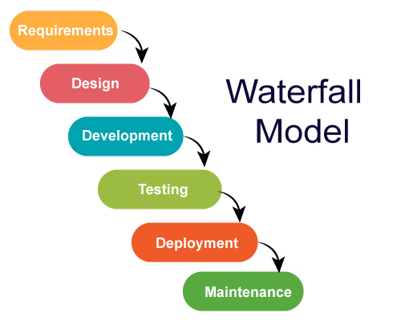
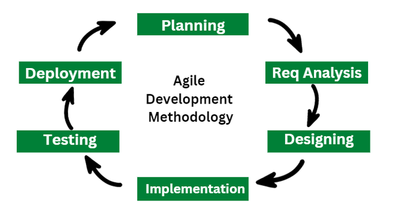

## 1. الـ Waterfall Method (طريقة الشلال)

### **المفهوم الأساسي:**

طريقة الشلال هي عبارة عن شوية خطوات تحت بعض أما أخلص الخطوه الأولي بخلصها وأقفل عليها وأخش علي التانيه

### **مراحل الـ Waterfall:**

1. **الـ Requirements** (متطلبات المشروع)
2. **الـ Design** (التصميم)
3. **الـ Implementation** (التطوير والبرمجة)
4. **الـ Verification / Testing** (الاختبار والتأكد من الجودة)
5. **الـ Maintenece** (الصيانة)

### **عيوب الطريقة:**

- الطريقة دي مش واضحه صعب أنك تقول خلصنا التصميم ده كده لأن فيه تغيرات لازم تتم بمعني أن كل خطوه في دول لازم ترجع تغير فيها تاني
- الموضوع عبارة عن حلقة شغاله ومش بتخلص خالص المفروض
- الموضوع بيخلص أما أنت تسيب الشركه أو العميل خلاص مش عاوز المنتج
- في ال waterfall لو سلمت للعميل المنتج وطلع فيه أخطاء هترجع تجيب الشغل كله من الأول تاني

---

## 2. الـ Agile Methodology

### **المفهوم الأساسي:**

- تقسيم المشروع إلى أجزاء صغيرة (**Features**)، بحيث تمر كل ميزة صغيرة بكل مراحل التطوير بشكل مستقل، ثم تكرار العملية للميزات التالية.
- الفكره هنا بتقسم مشروعك لأجزاء وتبدأ تشتغل عليها وتعدي كل ال cycle دي علي ال feature الصغيرة دي بس وهكذا في بقيت الميزات

### **دورة العمل (Cycle):**

1. **الـ Brainstorm** ( العصف الذهني والأفكار)
2. **الـ Design** (التصميم)
3. **الـ Developement** (التطوير)
4. **الـ QA** (جودة وتدقيق)
5. **الـ Deployment** (النشر)
6. **الـ Deliverd to Client** (التسليم للعميل)
7. **الـ Feedbacks** (ملاحظات العميل والمستخدمين)
8. **الـ Next Iteration & New Version** (إصدار جديد بناءً على الملاحظات)

### **آلية الـ Sprints:**

- تتكون عملية الـ Agile من دورات زمنية تُسمى **Sprints**.
- مدة الـ Sprint تتراوح عادة بين **أسبوع إلى أسبوعين**.
- يتم تحديد ميزة واحدة (Feature) للعمل عليها خلال الـ Sprint وتسليمها.
- *مثال:* تنفيذ ميزة الـ Login يستغرق Sprint مدته أسبوعين.

---

## 3. الـ Roles Around a Software Engineer (SWE)

الأدوار والوظائف المحيطة بمهندس البرمجيات في فريق العمل:

- **الـ Product Manager (PM):** مدير المنتج والمسؤول عن رؤية وتحديد متطلبات المشروع.
- **الـ UI/UX Designers:** مصممو واجهة وتجربة المستخدم.
- **الـ Technical Program Manager (TPM):** مدير البرامج التقنية والمشرف على التنسيق والتنفيذ الفني.
- **الـ QA / Test Engineer:** مهندس جودة البرمجيات واختبار النظام.
- **الـ DevOps / SRE (Site Reliability Engineer):** المسئولون عن رفع الكود للإنتاج (Production) ومراقبته.
- **الـ Business Development:** فريق تطوير الأعمال والربط مع احتياجات السوق.
- **الـ Managers:** المدراء التنفيذيون والمباشرون.